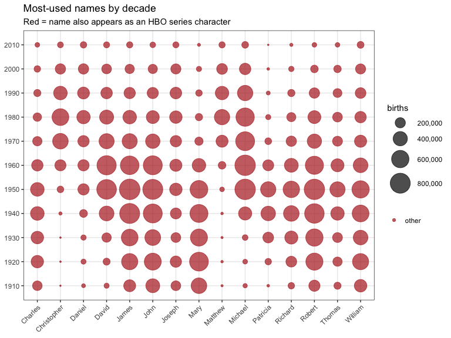
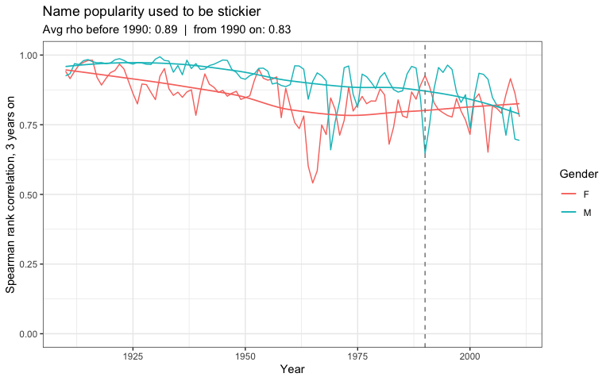
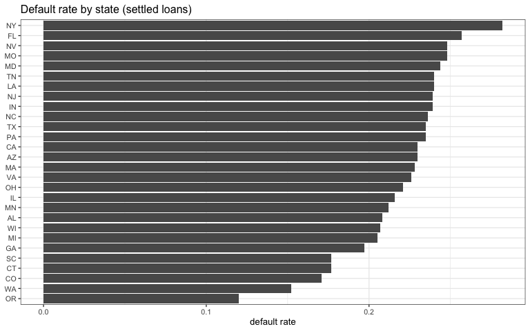
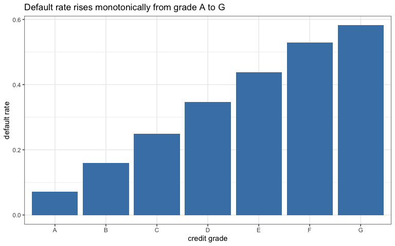
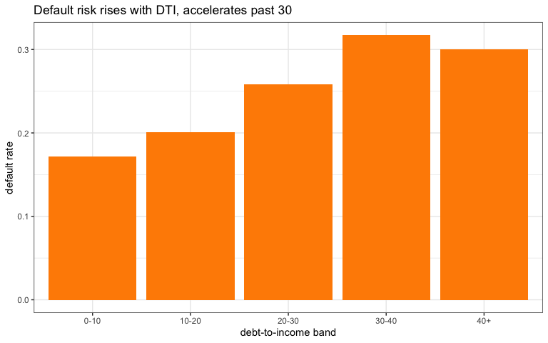
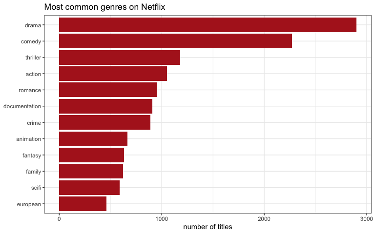
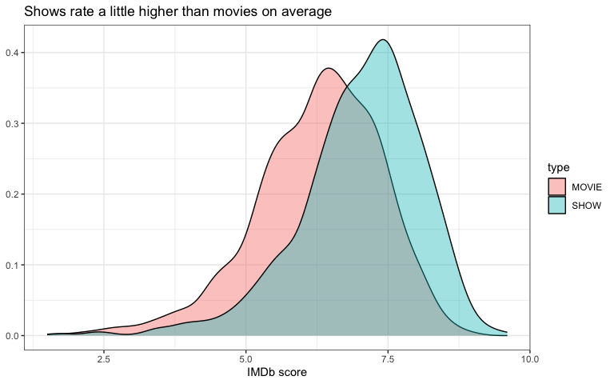
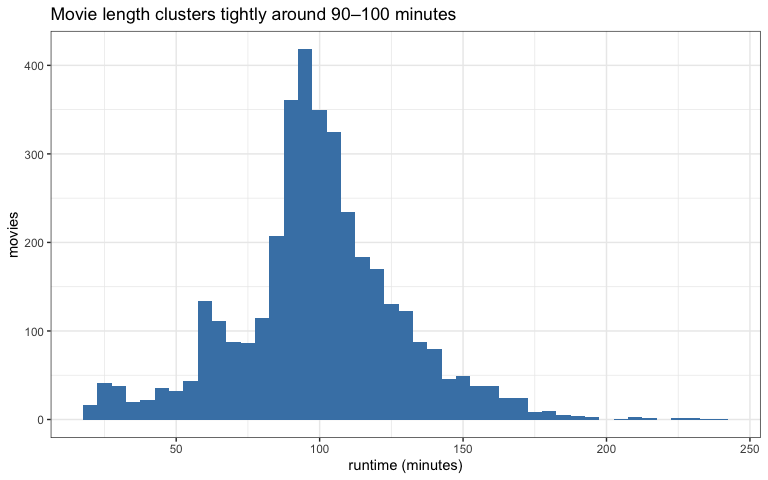
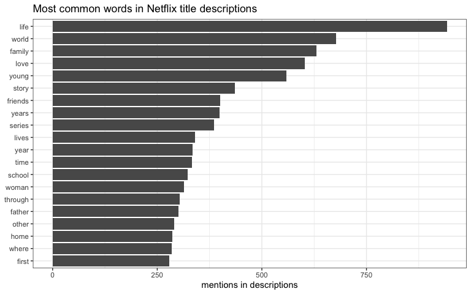

# Purpose

Student number: 25052977. This README walks through how I approached
each question: what I decided to do, why, and what I found. The actual
analysis functions all live in the `code/` folder inside each question’s
directory; the reports and this README just source and call them. Data
is not committed. Unzip `PracData26Folder.zip` into a `data/` folder at
the root and the paths will line up.

**Note on Texevier:** I ran into issues getting Texevier templates to
knit correctly on my machine, so I used standard Rmarkdown output
instead: PowerPoint for Question 1 (as the brief asks for slides) and
HTML for Questions 2, 3 and 4. The content, structure and functional
programming approach are intact; only the output format differs from
Texevier’s templates.

    25052977/
    ├── README.Rmd              <- this file (knits to README.md)
    ├── Question1_Coffee/
    │   ├── Question1.Rmd
    │   └── code/
    ├── Question2_BabyNames/
    │   ├── Question2.Rmd
    │   └── code/
    ├── Question3_Loans/
    │   ├── Question3.Rmd
    │   └── code/
    └── Question4_Netflix/
        ├── Question4.Rmd
        └── code/

------------------------------------------------------------------------

# Question 1: Coffee Hub

First thing I ran into: the CSV has typographic punctuation (curly
quotes, em dashes) that breaks keyword matching and displays badly. So
before anything else I wrote a loader (`Load_Coffee.R`) that reads the
file as UTF-8 and normalises all of that to plain ASCII. Once the text
was clean I could actually match it against the survey word-cloud.

The word-cloud was the key to the whole question. The entrepreneur cares
less about which coffees rate highly worldwide and more about what
Stellenbosch students will actually like. So I scored each review
against the survey keywords to get a local-preference signal on top of
the expert ratings. That combination drives the shortlist at the end.

For the deck I looked at whether price predicts quality (it barely
does), which regions and roasters come out on top, and which roast level
to stock.

``` r
list.files('Question1_Coffee/code/', full.names = T, recursive = T) %>%
  as.list() %>% walk(~source(.))

coffee   <- Load_Coffee(path = "data/Coffee/Coffee.csv")
coffee   <- Score_Keywords(coffee)
```

### Does paying more buy a better cup?

``` r
pq <- Price_Quality_Cor(coffee)
Top_Value(coffee, 10) %>% knitr::kable(caption = "Top 10 coffees by value (rating per unit cost)")
```

| Coffee | Roaster | Country | Rating | Cost/100g | Value |
|:-------------------------|:-----------------|:----------|-----:|-------:|-----:|
| Cold Brew | Barefoot Coffee Roasters | United States | 90 | 0.12 | 750.00 |
| Karen J Kona Red Bourbon | Hula Daddy Kona Coffee | Hawai’i | 94 | 0.17 | 552.94 |
| 100% Guatemalan | Hill’s Bros. Coffee | United States | 87 | 0.99 | 87.88 |
| Espresso Blend | Ba Yang Coffee | Taiwan | 92 | 1.13 | 81.42 |
| Asfaw Maru Ethiopia Natural Cold Brew | Collage Coffee | United States | 93 | 1.32 | 70.45 |
| Ethiopia Nano Challa Cold Brew | Bonfire Coffee Company | United States | 94 | 1.34 | 70.15 |
| Taiwan Natural Alishan Zhuo-Wu Geisha | Kakalove Cafe | Taiwan | 95 | 1.36 | 69.85 |
| 414 Kenya SL34 | Mr. Chao Coffee | Taiwan | 92 | 1.41 | 65.25 |
| 5a Sur | El Gran Cafe | Guatemala | 91 | 1.47 | 61.90 |
| 5a Poniente | El Gran Cafe | Guatemala | 91 | 1.47 | 61.90 |

Top 10 coffees by value (rating per unit cost)

Spearman rho is 0.346 (p = 5.51^{-60}). There is a moderate positive
link, but nowhere near strong enough to use price as a guide: paying
more does not reliably get you a better cup. So I built a value score
(rating per unit cost) and ranked on that instead.

### Which regions and roasters perform best?

``` r
regions  <- Region_Summary(coffee)
roasters <- Roaster_Summary(coffee)
regions  %>% head(8) %>% knitr::kable(caption = "Top regions by average rating")
```

| Region                 |   n | avg_rating | avg_cost | avg_kw |
|:-----------------------|----:|-----------:|---------:|-------:|
| Boquete Growing Region |  39 |      94.59 |    35.92 |  0.451 |
| Kiambu Growing Region  |  12 |      94.50 |     5.67 |  0.429 |
| Sidama Growing Region  |  14 |      94.43 |     7.89 |  0.423 |
| Holualoa               |  41 |      94.32 |    23.78 |  0.426 |
| Caicedonia             |  11 |      94.27 |    13.40 |  0.396 |
| Bench-Maji Zone        |  11 |      94.09 |    15.72 |  0.477 |
| Nyeri Growing Region   |  58 |      93.98 |     6.90 |  0.424 |
| Kirinyaga District     |  22 |      93.95 |     7.40 |  0.445 |

Top regions by average rating

``` r
roasters %>% head(8) %>% knitr::kable(caption = "Top roasters by average rating")
```

| Roaster                           |   n | avg_rating | avg_cost |
|:----------------------------------|----:|-----------:|---------:|
| Hula Daddy Kona Coffee            |  24 |      95.12 |    24.78 |
| Simon Hsieh Aroma Roast Coffees   |  11 |      94.64 |    22.78 |
| PT’s Coffee Roasting Co.          |  17 |      94.47 |    11.75 |
| Difference Coffee                 |   6 |      94.33 |   104.07 |
| GK Coffee                         |  36 |      94.25 |    11.44 |
| Dragonfly Coffee Roasters         |  37 |      94.19 |    16.34 |
| Simon Hsieh’s Aroma Roast Coffees |  11 |      94.18 |    13.58 |
| Kakalove Cafe                     | 141 |      94.16 |     6.52 |

Top roasters by average rating

### Which roast to stock?

``` r
rs <- Roast_Summary(coffee)
rs %>% knitr::kable(caption = "Average rating by roast level")
```

| Roast        |    n | avg_rating | avg_cost | avg_value |
|:-------------|-----:|-----------:|---------:|----------:|
| Light        |  287 |      93.52 |    11.44 |     12.74 |
| Medium-Light | 1490 |      93.23 |     8.99 |     15.59 |
| Medium       |  259 |      92.27 |     7.06 |     18.37 |
| Medium-Dark  |   39 |      91.87 |     9.51 |     20.34 |
| Dark         |    5 |      88.20 |     4.46 |     22.64 |

Average rating by roast level

Medium-Light dominates by review count; it is the specialty market
default. But Light roasts actually score higher at the top end. My
recommendation to the entrepreneur: lead with Medium-Light for volume,
keep a Light option for the highest-rated picks, and stock almost no
dark roasts.

### Good local picks (survey keywords + value)

``` r
Good_Local_Picks(coffee, 8) %>% knitr::kable(caption = "Coffees that match local taste descriptors and deliver value")
```

| Coffee | Roaster | Country | Rating | Cost/100g | Keywords | Value |
|:-----------------------|:---------------|:---------|-----:|------:|------:|----:|
| Panama Finca San Sebastian | Jackrabbit Java | United States | 94 | 3.53 | 19 | 26.63 |
| Finca Tasta Peru | Bird Rock Coffee Roasters | United States | 93 | 6.91 | 19 | 13.46 |
| Panama Baru Geisha Natural by Joseph | Kakalove Cafe | Taiwan | 94 | 13.45 | 19 | 6.99 |
| Yemen Microlot | Dragonfly Coffee Roasters | United States | 96 | 33.07 | 19 | 2.90 |
| Ethiopia | Caffeic | United States | 93 | 4.12 | 18 | 22.57 |
| Ethiopia Yirgacheffe Chelelektu Natural | Dragonfly Coffee Roasters | United States | 96 | 5.29 | 18 | 18.15 |
| Ethiopia Guji Gigessa | Roasters Note | Taiwan | 94 | 6.51 | 18 | 14.44 |
| Ethiopia Bench Maji Natural Gesha | VERYTIME | Taiwan | 94 | 7.79 | 18 | 12.07 |

Coffees that match local taste descriptors and deliver value

The full PowerPoint deck with all slides is in
`Question1_Coffee/Question1.pptx`.

------------------------------------------------------------------------

# Question 2: Baby Names

The agency has two things they want to understand: which names have
staying power, and which ones spike because of a cultural moment (and
then fade). I decided to work at the national level rather than by
state. The agency is designing toys for a national market, so the
state-by-state variation would just add noise without answering the
actual question.

``` r
list.files('Question2_BabyNames/code/', full.names = T, recursive = T) %>%
  as.list() %>% walk(~source(.))

baby   <- readr::read_rds("data/US_Baby_names/Baby_Names_By_US_State.rds")
hbo    <- readr::read_rds("data/US_Baby_names/HBO_credits.rds")
charts <- readr::read_rds("data/US_Baby_names/charts.rds")
nat    <- National_Counts(baby)
```

### Most popular names by decade

I took the 15 highest-count names overall and plotted births by decade
as a bubble chart. I also flagged which of those names appear as HBO
character names. The brief hints at TV shows driving name spikes, so I
wanted to see whether the most popular names were also being used as
character names, and whether that came before or after the name’s peak.

``` r
char_names <- HBO_Character_Firstnames(hbo)
top15 <- Top_Names_Overall(nat, 15)
Bubble_Data(nat, top15) %>%
  mutate(is_char = Name %in% char_names) %>%
  ggplot(aes(Name, factor(Decade), size = n, colour = is_char)) +
  geom_point(alpha = 0.7) +
  scale_size_area(max_size = 12, labels = scales::comma) +
  scale_colour_manual(values = c(`FALSE` = "grey55", `TRUE` = "firebrick"),
                      labels = c("other", "also an HBO character name")) +
  labs(x = NULL, y = NULL, size = "births", colour = NULL,
       title = "Most-used names by decade",
       subtitle = "Red = name also appears as an HBO series character") +
  theme_bw(base_size = 11) +
  theme(axis.text.x = element_text(angle = 45, hjust = 1))
```



What you can see is that the popular names were already popular: the
shows borrowed them rather than driving them. At least for these
long-run favourites.

### How persistent is name popularity?

The brief specifically asked for Spearman rank correlation. For each
year I take the top 25 names per gender and compare their ranking to the
same ranking three years later. A rho close to 1 means the same names
are still at the top; a falling rho means the rankings are shuffling
faster.

``` r
ps <- Persistence_Series(nat, top = 25, lag = 3)
pre  <- mean(ps$rho[ps$Year <  1990], na.rm = TRUE)
post <- mean(ps$rho[ps$Year >= 1990], na.rm = TRUE)

ps %>%
  ggplot(aes(Year, rho, colour = Gender)) +
  geom_line() +
  geom_smooth(se = FALSE, linewidth = 0.6) +
  geom_vline(xintercept = 1990, linetype = "dashed", colour = "grey50") +
  ylim(0, 1) +
  labs(y = "Spearman rank correlation, 3 years on",
       title = "Name popularity used to be stickier",
       subtitle = paste0("Avg rho before 1990: ", round(pre,2),
                         "  |  from 1990 on: ", round(post,2))) +
  theme_bw(base_size = 11)
```



The agency’s suspicion checks out. Persistence has softened since 1990:
average rho dropped from 0.89 to 0.83. A name at the top now is less
likely to still be there three years later than it would have been in
earlier decades. That has direct implications for when to launch a
product tie-in.

### Surges that track culture

I looked for names that at least tripled in a single year, then
cross-referenced against Billboard artists charting in the two years
before the spike. The idea is: if a name surges and an artist with that
first name was charting just before, that is a plausible cultural cause.

``` r
Annotate_Surges(Name_Surges(nat), charts) %>% knitr::kable()
```

| Name    | Gender | Year | prev_count | count | growth | billboard_artist |
|:--------|:-------|-----:|-----------:|------:|-------:|:-----------------|
| Jaime   | F      | 1976 |        897 |  7836 |    8.7 | NA               |
| Cheryl  | F      | 1943 |        550 |  2875 |    5.2 | NA               |
| Jenna   | F      | 1984 |       1148 |  5877 |    5.1 | NA               |
| Mariah  | F      | 1991 |       1086 |  5190 |    4.8 | Mariah Carey     |
| Ethan   | M      | 1989 |        872 |  4053 |    4.6 | NA               |
| Selena  | F      | 1995 |        865 |  3804 |    4.4 | Selena           |
| Shaun   | M      | 1977 |        585 |  2575 |    4.4 | Shaun Cassidy    |
| Ramona  | F      | 1928 |        520 |  2229 |    4.3 | NA               |
| Brenda  | F      | 1939 |        646 |  2736 |    4.2 | NA               |
| Darrin  | M      | 1965 |        784 |  3254 |    4.2 | NA               |
| Gael    | M      | 2012 |        645 |  2733 |    4.2 | NA               |
| Jase    | M      | 2013 |       1100 |  4539 |    4.1 | NA               |
| Brett   | M      | 1958 |        606 |  2119 |    3.5 | NA               |
| Jeremy  | M      | 1969 |        609 |  2074 |    3.4 | NA               |
| Lizbeth | F      | 2002 |        754 |  2553 |    3.4 | NA               |

Mariah in 1991, Selena in 1995, Shaun Cassidy in 1977: the matches are
there. The pattern confirms what the agency suspected. But read
alongside the persistence result, a name that rides a cultural moment
also tends to fade with it. The agency should time any character tie-in
to the surge rather than assume it will stick.

------------------------------------------------------------------------

# Question 3: Loans and Credit

The first thing I had to sort out was the outcome variable. The brief
says “Current means everything is up to date”, so Current loans do not
have a known outcome yet. Including them would drag the default rate
down artificially. I filtered to settled loans only (Fully Paid or
Charged Off/Default) and built the default flag from there. That logic
is in `Load_Loans.R`.

The dataset is about a million rows, which is slow to work with
interactively. I draw a reproducible 50,000-loan sample; the directions
are stable at that size and it runs in a reasonable time.

``` r
list.files('Question3_Loans/code/', full.names = T, recursive = T) %>%
  as.list() %>% walk(~source(.))

loans  <- Load_Loans(path = "data/Loan_Cred/loan_data.rds", sample_n = 50000)
s_rate <- mean(Settled_Loans(loans)$default)
```

Overall default rate on settled loans: **22.6%**.

### Belief 1 — home owners and long-tenure staff default less on short-term loans

``` r
Belief_Home_Tenure(loans) %>% knitr::kable()
```

| Term        | Homeowner      | Tenure        |    n | default_rate |
|:------------|:---------------|:--------------|-----:|-------------:|
| 36m (short) | renter/other   | \<10 yrs / na | 4549 |        0.237 |
| 36m (short) | renter/other   | 10+ yrs       | 1477 |        0.225 |
| 36m (short) | owner/mortgage | \<10 yrs / na | 5422 |        0.168 |
| 36m (short) | owner/mortgage | 10+ yrs       | 3369 |        0.142 |
| 60m (long)  | renter/other   | \<10 yrs / na | 1016 |        0.464 |
| 60m (long)  | renter/other   | 10+ yrs       |  393 |        0.438 |
| 60m (long)  | owner/mortgage | \<10 yrs / na | 1677 |        0.308 |
| 60m (long)  | owner/mortgage | 10+ yrs       | 1228 |        0.297 |

Home ownership and long tenure do show lower default rates, but the
effect is modest compared to loan term: 60-month loans default at
roughly double the rate of 36-month loans in every single group. So the
belief points the right way, but term is the bigger story.

### Belief 2 — states differ in default “culture”

``` r
st <- Belief_State(loans)
rbind(head(st, 5), tail(st, 5)) %>% knitr::kable(caption = "Highest and lowest default-rate states")
```

| State |    n | default_rate |
|:------|-----:|-------------:|
| NY    | 1460 |        0.282 |
| FL    | 1459 |        0.257 |
| MO    |  306 |        0.248 |
| NV    |  335 |        0.248 |
| MD    |  443 |        0.244 |
| CT    |  288 |        0.177 |
| SC    |  249 |        0.177 |
| CO    |  415 |        0.171 |
| WA    |  402 |        0.152 |
| OR    |  225 |        0.120 |

Highest and lowest default-rate states

``` r
st %>%
  ggplot(aes(reorder(State, default_rate), default_rate)) +
  geom_col(fill = "grey35") + coord_flip() +
  labs(x = NULL, y = "default rate", title = "Default rate by state (settled loans)") +
  theme_bw(base_size = 10)
```



There is a real spread, about 16 percentage points from highest to
lowest. But I am sceptical this reflects a genuine “culture of
defaulting”: it more likely reflects borrower mix, since states with
more low-grade, high-interest, 60-month borrowers will show higher rates
regardless of culture. The spread is genuine; the cultural reading is
what I would push back on.

### Belief 3 — credit grade and interest rate predict default

``` r
Belief_Grade(loans) %>% knitr::kable()
```

| Grade |    n | default_rate | avg_int_rate |
|:------|-----:|-------------:|-------------:|
| A     | 3406 |        0.071 |         6.89 |
| B     | 5615 |        0.159 |        10.23 |
| C     | 5506 |        0.250 |        13.77 |
| D     | 2784 |        0.346 |        18.25 |
| E     | 1261 |        0.438 |        22.11 |
| F     |  418 |        0.529 |        25.75 |
| G     |  141 |        0.582 |        28.88 |

``` r
Belief_Grade(loans) %>%
  ggplot(aes(Grade, default_rate)) +
  geom_col(fill = "steelblue") +
  labs(x = "credit grade", y = "default rate",
       title = "Default rate rises monotonically from grade A to G") +
  theme_bw(base_size = 11)
```



This is the strongest of the three beliefs, and the data backs it up.
Default rate climbs monotonically from A to G, and interest rate tracks
it almost perfectly, which makes sense since Lending Club sets the rate
from the grade.

### Quantifying the drivers (logistic regression, odds ratios)

``` r
Risk_Model(loans) %>% knitr::kable()
```

| driver           | odds_ratio | ci_low | ci_high | p_value |
|:-----------------|-----------:|-------:|--------:|--------:|
| (Intercept)      |      0.043 |  0.036 |   0.050 |  0.0000 |
| int_rate         |      1.116 |  1.108 |   1.124 |  0.0000 |
| term_months      |      1.016 |  1.012 |   1.020 |  0.0000 |
| is_homeownerTRUE |      0.659 |  0.613 |   0.709 |  0.0000 |
| emp_10plusTRUE   |      0.909 |  0.841 |   0.981 |  0.0148 |

Each extra percentage point of interest rate raises default odds by
about 12%. I used interest rate rather than grade as the risk signal
because the two are almost perfectly collinear: Lending Club determines
the rate from the grade, so putting both in would be redundant. Home
ownership and long tenure both reduce default odds, but their effects
are smaller than the rate signal.

### What DTI cap makes sense?

``` r
DTI_Default(loans) %>% knitr::kable()
```

| dti_band |    n | default_rate |
|:---------|-----:|-------------:|
| 0-10     | 3389 |        0.172 |
| 10-20    | 7764 |        0.201 |
| 20-30    | 5777 |        0.258 |
| 30-40    | 2021 |        0.317 |
| 40+      |  160 |        0.300 |

``` r
DTI_Default(loans) %>%
  ggplot(aes(dti_band, default_rate)) +
  geom_col(fill = "darkorange") +
  labs(x = "debt-to-income band", y = "default rate",
       title = "Default risk rises with DTI, accelerates past 30") +
  theme_bw(base_size = 11)
```



Risk rises steadily with DTI and clearly accelerates past 30. I would
put a hard cap somewhere in the DTI 30–35 range: below that the default
rate is manageable, above it you are taking on meaningfully more risk.
Cap at 25 if you want to be conservative, 35 if you can tolerate more
exposure.

### Is Texas different?

``` r
Texas_Vs_Rest(loans) %>% knitr::kable()
```

| region     |     n | default_rate | avg_dti | avg_int_rate |
|:-----------|------:|-------------:|--------:|-------------:|
| Rest of US | 17456 |        0.225 |    18.6 |         13.1 |
| Texas      |  1675 |        0.235 |    19.5 |         12.9 |

``` r
DTI_Default_Texas(loans) %>% knitr::kable(caption = "Default rate by DTI band: Texas vs rest")
```

| dti_band | Rest of US | Texas |
|:---------|-----------:|------:|
| 0-10     |      0.173 | 0.158 |
| 10-20    |      0.200 | 0.207 |
| 20-30    |      0.257 | 0.271 |
| 30-40    |      0.318 | 0.309 |
| 40+      |      0.282 | 0.444 |

Default rate by DTI band: Texas vs rest

Texas tracks the national picture closely at every DTI band. There is no
case for a separate policy: one cap works for both.

------------------------------------------------------------------------

# Question 4: Netflix

The brief gives a lot of freedom here; the team just wants to know what
works on the platform before they build their own. I looked at the
content mix, which genres rate well (as opposed to which are simply
well-stocked), how titles score overall, how long the films run, and
what the descriptions are actually about at a textual level. That last
one is useful for positioning: if you know what themes dominate, you can
decide what territory to own differently.

``` r
list.files('Question4_Netflix/code/', full.names = T, recursive = T) %>%
  as.list() %>% walk(~source(.))

nf <- Load_Netflix(path = "data/netflix/titles.rds")
```

### What is on the platform?

``` r
Type_Split(nf) %>% knitr::kable(caption = "Movies vs shows")
```

| type  | titles |
|:------|-------:|
| MOVIE |   3759 |
| SHOW  |   2047 |

Movies vs shows

``` r
Country_Summary(nf, 10) %>% knitr::kable(caption = "Top production countries")
```

| country | titles |
|:--------|-------:|
| US      |   2327 |
| IN      |    629 |
| GB      |    406 |
| JP      |    291 |
| FR      |    248 |
| CA      |    216 |
| KR      |    216 |
| ES      |    212 |
| DE      |    139 |
| MX      |    123 |

Top production countries

Mostly films, heavily US-led. India, the UK, Japan and South Korea make
up most of the rest. Korean and Japanese content is a meaningful slice,
worth watching for a new entrant who wants to avoid the most crowded
part of the market.

### Which genres dominate — and do they rate well?

``` r
gs <- Genre_Summary(nf, 12)

gs %>%
  ggplot(aes(reorder(genre, titles), titles)) +
  geom_col(fill = "firebrick") +
  coord_flip() +
  labs(x = NULL, y = "number of titles", title = "Most common genres on Netflix") +
  theme_bw(base_size = 11)
```



``` r
gs %>% knitr::kable()
```

| genre         | titles | avg_imdb |
|:--------------|-------:|---------:|
| drama         |   2901 |     6.66 |
| comedy        |   2269 |     6.42 |
| thriller      |   1178 |     6.36 |
| action        |   1053 |     6.46 |
| romance       |    958 |     6.44 |
| documentation |    910 |     7.04 |
| crime         |    891 |     6.68 |
| animation     |    665 |     6.73 |
| fantasy       |    631 |     6.58 |
| family        |    622 |     6.34 |
| scifi         |    587 |     6.58 |
| european      |    460 |     6.54 |

Drama and comedy dominate by count, but they sit in the middle of the
IMDb table. Documentation and history have far fewer titles but rate
considerably higher. Volume and quality are not the same thing, which is
worth knowing for a team deciding what to commission.

### How do titles rate?

``` r
Ratings_By_Type(nf) %>% knitr::kable(caption = "Average IMDb score by type")
```

| type  |    n | median_imdb | mean_imdb |
|:------|-----:|------------:|----------:|
| MOVIE | 3407 |         6.4 |      6.27 |
| SHOW  | 1876 |         7.2 |      7.02 |

Average IMDb score by type

``` r
nf %>%
  filter(!is.na(imdb_score)) %>%
  ggplot(aes(imdb_score, fill = type)) +
  geom_density(alpha = 0.4) +
  labs(x = "IMDb score", y = NULL, title = "Shows rate a little higher than movies on average") +
  theme_bw(base_size = 11)
```



Shows rate higher on average, but the spread is wide for both types:
there is a lot of low-rated content sitting alongside the hits. A new
service that curates rather than stocks everything could differentiate
on quality alone.

### How long are the movies?

``` r
Movies_Runtime(nf) %>%
  ggplot(aes(runtime)) +
  geom_histogram(binwidth = 5, fill = "steelblue") +
  labs(x = "runtime (minutes)", y = "movies",
       title = "Movie length clusters tightly around 90–100 minutes") +
  theme_bw(base_size = 11)
```



The 90–100 minute feature is the overwhelming norm. There is almost no
appetite on the platform for anything under 70 or over 130 minutes,
which is useful to know when commissioning.

### What is the catalogue actually about?

``` r
Description_Words(nf, 20) %>%
  ggplot(aes(reorder(word, n), n)) +
  geom_col(fill = "grey35") +
  coord_flip() +
  labs(x = NULL, y = "mentions in descriptions",
       title = "Most common words in Netflix title descriptions") +
  theme_bw(base_size = 11)
```



Life, family, love, young and friends dominate. The platform keeps
returning to the same emotional territory. For a new entrant that is
actually useful: it tells you what is saturated, and the themes absent
from the list might be where there is space to position differently.
